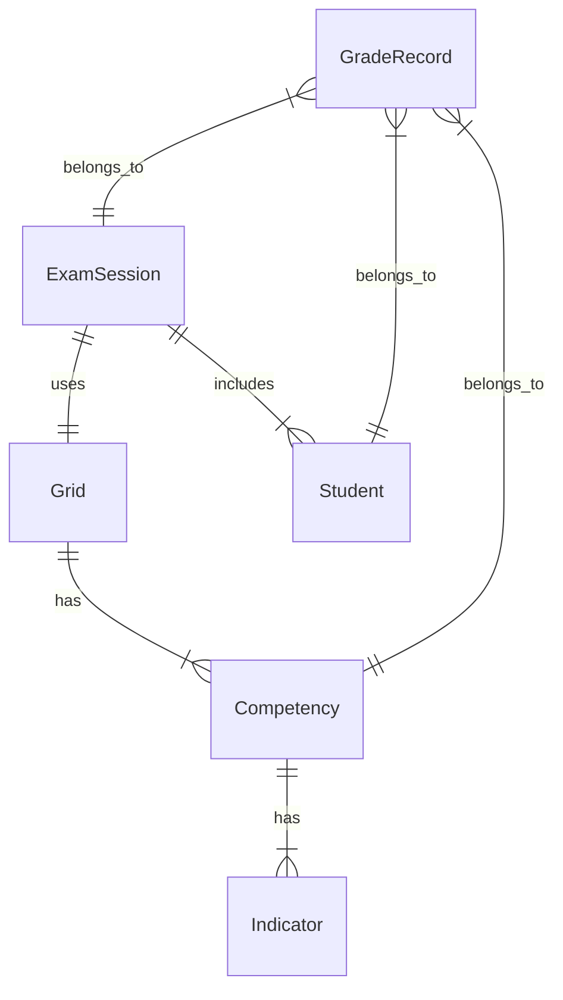

# System Architecture - PEQ_Grader

**Status:** APPROVED
**Version:** 1.0

## 1. System Overview
The **PEQ_Grader** is a **Local-First**, **Tablet-Optimized** web application designed to digitize the grading process in vocational workshops.
It functions primarily as a "Digital Clipboard" that replaces paper grids, offering instant feedback and data persistence without reliable internet.

### 1.1. System Metaphor
*   **The Brain (Local DB):** The device (Teacher's Tablet) holds the "Source of Truth" during the exam.
*   **The Nervous System (React/Zustand):** Immediate reaction to user input (tapping a grade).
*   **The Memory (Backup):** JSON exports to ensure data survivability across devices.

## 2. Technology Stack

### 2.1. Frontend Core
*   **Framework:** Next.js 14+ (App Router) - Static Export capability preferred (SPA mode).
*   **Language:** TypeScript - Strict mode.
*   **Performance:** React Compiler (if stable) or careful `useMemo` for the Matrix View.

### 2.2. State & Persistence (The "Local-First" Engine)
*   **Database:** **IndexedDB** wrapped via **Dexie.js**.
    *   *Rationale:* Robust, queryable, handles large datasets (thousands of records) smoothly compared to localStorage.
*   **State Management:** **Zustand**.
    *   *Usage:* Ephemeral UI state (Modals, Active Filters, Toasts).
    *   *Sync:* `useLiveQuery` (Dexie hook) binds DB data directly to React components.

### 2.3. Styling & UX
*   **Engine:** **Tailwind CSS**.
*   **Design System:** Semantic utility classes (e.g., `bg-status-acquis`, `h-touch-target`).
*   **Touch Optimization:**
    *   `touch-action: manipulation` to prevent double-tap zoom.
    *   Minimum 44px hit areas.
    *   Swipe gestures for navigation.

## 3. Data Architecture

### 3.1. Entity Relationship Diagram


### 3.2. Schema Definitions (Dexie)
The schema implements a **Copy-on-Write** strategy for Grids. When an Exam is created, the Grid structure is embedded (or frozen) to ensure historical accuracy even if the template changes later.

#### Tables

1.  **`grids`** (Templates)
    *   `id` (UUID)
    *   `name` (string)
    *   `structure` (JSON Object):
        ```json
        {
          "competencies": [
            { "id": "c1", "label": "...", "indicators": [{ "id": "i1", "text": "...", "critical": true }] }
          ]
        }
        ```
    *   `version` (number)

2.  **`students`**
    *   `id` (UUID)
    *   `firstName` (string)
    *   `lastName` (string)
    *   `group` (string)

3.  **`exams`** (The Operational Unit)
    *   `id` (UUID)
    *   `date` (ISO Date)
    *   `label` (string)
    *   `frozenGridStructure` (JSON Object) - *The Snapshot of the Grid at creation time.*
    *   `studentIds` (Array<UUID>)

4.  **`grades`** (Transactional)
    *   `pk`: `[examId+studentId+competencyId]` (Compound Primary Key)
    *   `examId`, `studentId`, `competencyId` (Indexed)
    *   `status`: 'PENDING' | 'ACQUIS' | 'NON_ACQUIS' | 'REMEDIATION'
    *   `data`: `string` (JSON stringified content):
        ```json
        {
          "checkedIndicatorIds": ["i1", "i3"],
          "teacherComment": "Good job but missed safety check.",
          "timestamp": 123456789
        }
        ```

## 4. Local-First & Sync Strategy

### 4.1. The "No-Backend" Approach (MVP)
To minimize complexity and dependence on school IT:
1.  **Initialization:** Teacher opens app. If DB is empty, prompts to "Create New" or "Import Backup".
2.  **During Exam:** All writes go to IndexedDB.
3.  **End of Day (Backup):** Teacher clicks "Export Data".
    *   **Action:** System dumps all Dexie tables to a single JSON file (`PEQ_Backup_YYYY-MM-DD.json`).
    *   **Mechanism:** `Blob` creation and auto-download.
4.  **Restore:**
    *   **Action:** Upload JSON file in Settings.
    *   **Logic:** Replaces *or* Merges local DB (User prompt: "Overwrite" vs "Merge" - *MVP default: Overwrite*).

### 4.2. Conflict Resolution
*   *MVP Strategy:* Last Write Wins / Manual Overwrite.
*   Since currently single-user (one teacher per exam), real-time collisions are non-existent.

## 5. Security & Privacy
*   **Data at Rest:** Stored in Browser's IndexedDB. Cleared if user wipes browser data.
*   **Privacy:** No cloud transmission. Data stays on device physically.
*   **GDPR:** Document that the Teacher is the Data Controller and the device is the storage medium.
